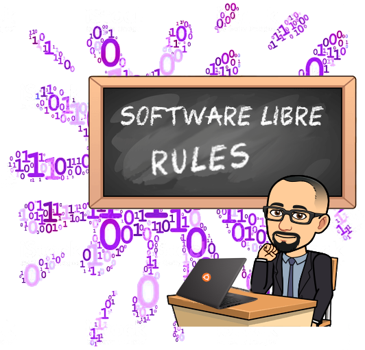

 

  

- 👋 Hola, soy Matias Garcia de Buenos Aires, Argentina.
- 💻 Profesor y Técnico en Informática Aplicada, Licenciado en Tecnología Educativa por la Universidad Tecnológica Nacional. 
- 👀 Aquí encontrarás los ejemplos de código de distintos lenguajes que suelo utilizar en clase y otros proyectos interesantes para ver.
- 📝 En www.profmatiasgarcia.com.ar encontrarás los apuntes y ejercicios que utilizo en las clases. 
- 📽️ En mi canal de YouTube (www.youtube.com/user/profmatiasgarcia) podrás ver video tutoriales propios y otros seleccionados de diferentes temáticas.
